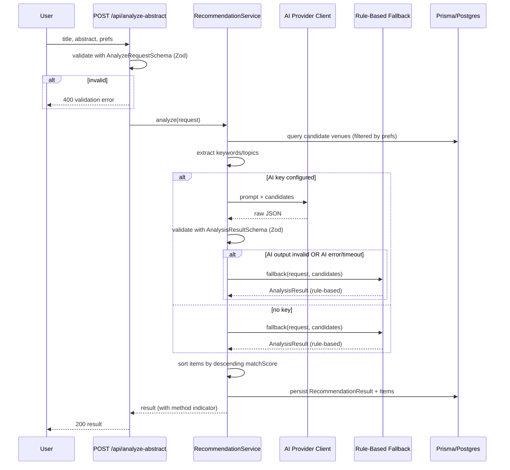
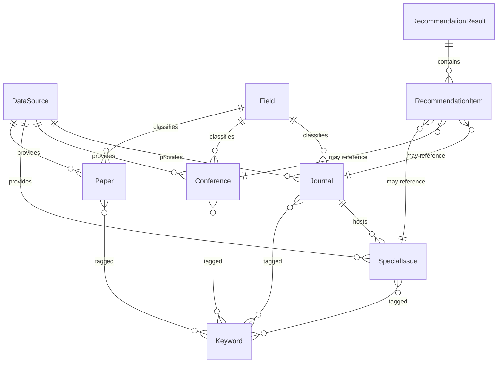
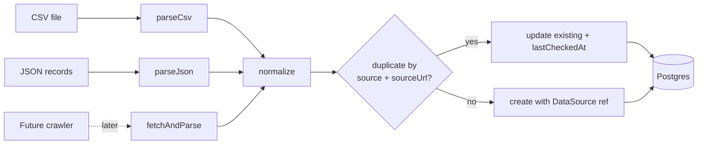

# Design Document

## Overview

PaperScout AI is a full-stack Next.js (App Router) application that helps researchers discover academic venues (journals, conferences, special issues) and select where to submit a paper. Its signature feature is an Abstract Analyzer that takes a title + abstract and returns ranked, grounded venue recommendations produced either by an external AI model or a deterministic rule-based fallback.

The design is governed by one non-negotiable principle: **data integrity**. The system never fabricates venue data. Every Journal, Conference, and Special Issue is traceable to a `DataSource` record (sample seed, CSV/JSON import, or a future crawler) and carries provenance fields. Until a record is verified against an authoritative source, it is labeled as unverified mock data in both the UI and the README.

This document describes the architecture, the Prisma data model, the AI recommendation service (including its rule-based fallback), the search/filter service, the ingestion module skeleton, the API contracts and Zod schemas, error handling, security, and the correctness properties that drive property-based testing.

### Design Goals

- **Grounded recommendations**: every recommended venue must be a row that already exists in the database.
- **Resilience**: the analyzer always returns a result; AI failures degrade gracefully to the rule-based path.
- **Schema-first**: every boundary (API input, AI output, ingestion record) is validated with Zod before it is trusted.
- **Provenance everywhere**: no venue without a `DataSource` and source/official URLs.
- **Separation of concerns**: thin route handlers, fat service layer, isolated data layer, admin code separated for future auth.

### Technology Stack

| Layer | Technology |
| --- | --- |
| Frontend | Next.js App Router, TypeScript, Tailwind CSS, Shadcn UI |
| Forms & validation | React Hook Form + Zod (shared schemas) |
| Backend | Next.js Route Handlers (`app/api/**/route.ts`) |
| Service layer | TypeScript modules under `src/lib/services` |
| ORM / DB | Prisma ORM + PostgreSQL |
| AI | Pluggable provider client + deterministic rule-based fallback |

## Architecture

### High-Level Architecture

```mermaid
graph TD
    subgraph Client[Browser]
        LP[Landing Page]
        SP[Search Page]
        DP[Detail Pages: Journal/Conference/SpecialIssue]
        AA[Abstract Analyzer Page]
        SR[Saved Recommendations Page]
        AD[Admin Data Management Page]
    end

    subgraph API[Next.js Route Handlers]
        SEARCH[GET /api/search]
        LISTS[GET /api/journals|conferences|special-issues]
        ONE[GET /api/.../:id]
        ANALYZE[POST /api/analyze-abstract]
        RECS[GET /api/recommendations/:id]
        SAVED[GET/POST /api/saved-recommendations]
        SEED[POST /api/admin/seed]
    end

    subgraph Services[Service Layer src/lib]
        RECSVC[AI Recommendation Service]
        FALLBACK[Rule-Based Fallback]
        SEARCHSVC[Search Service]
        ADMINSVC[Admin Service]
        INGEST[Ingestion Module]
        AICLIENT[AI Provider Client]
    end

    subgraph Data[Data Layer]
        PRISMA[Prisma Client]
        PG[(PostgreSQL)]
    end

    LP --> SEARCH
    SP --> SEARCH
    DP --> ONE
    AA --> ANALYZE
    SR --> SAVED
    AD --> LISTS
    AD --> SEED

    SEARCH --> SEARCHSVC
    LISTS --> SEARCHSVC
    ONE --> SEARCHSVC
    ANALYZE --> RECSVC
    RECS --> RECSVC
    SAVED --> RECSVC
    SEED --> ADMINSVC

    RECSVC --> AICLIENT
    RECSVC --> FALLBACK
    RECSVC --> PRISMA
    SEARCHSVC --> PRISMA
    ADMINSVC --> INGEST
    ADMINSVC --> PRISMA
    INGEST --> PRISMA
    PRISMA --> PG
```

### Layered Responsibilities

1. **Presentation (App Router pages)** — server and client components rendering venue data, the analyzer form, and result views. Forms use React Hook Form with the shared Zod schemas. Pages render the unverified-mock-data labels.
2. **API (Route Handlers)** — thin adapters. Each handler parses/validates input with Zod, calls a service, maps the service result to an HTTP response, and maps known errors to status codes. Handlers contain no business logic.
3. **Service layer** — all business logic: search filtering, recommendation generation, fallback scoring, ingestion, seeding. Services depend on a Prisma client interface and are unit/property testable in isolation.
4. **Data layer** — Prisma schema + client. Provenance fields enforced at the model level.

### Request Flow: Abstract Analysis



Note: per Requirement 7.8, if the AI output fails schema validation the system rejects that output. Per Requirement 15.2 the request must not crash, so the service falls back to the rule-based path rather than returning an error, except where the failure is in the AI step specifically — the rule-based result is always schema-valid and is persisted. A recommendation error is returned (without persisting) only when even the fallback cannot produce a schema-valid result (e.g., no candidate venues plus an internal error).

## Components and Interfaces

### Frontend Pages (App Router)

| Route | Purpose | Key Requirements |
| --- | --- | --- |
| `/` | Landing page: intro, CTA to analyzer, nav links, mock-data notice | 1.1–1.4 |
| `/search` | Unified search with filters and empty-state | 2.* |
| `/journals`, `/journals/[id]` | Journal list and detail | 3.*, 13.2, 13.3 |
| `/conferences`, `/conferences/[id]` | Conference list and detail | 5.*, 13.2, 13.3 |
| `/special-issues`, `/special-issues/[id]` | Special issue list and detail | 4.*, 13.2, 13.3 |
| `/analyze` | Abstract Analyzer form + results | 6.*, 7.*, 8.5 |
| `/recommendations/[id]` | View a persisted result | 9.2, 9.3 |
| `/saved` | Saved recommendations list | 9.4, 9.5 |
| `/admin/data` | Admin management + seed trigger | 12.1, 12.2 |

Every venue display component renders a `DataSourceBadge` showing the source label and an "Unverified sample data" indicator (Req 2.15, 10.3), and a `FieldValue` helper that renders an explicit "missing / unverified" indicator when a field is null or its status is unverified (Req 3.3, 4.4, 5.5).

### Service Interfaces

```typescript
// src/lib/services/search-service.ts
interface SearchService {
  search(params: SearchParams): Promise<SearchResults>;
}

// src/lib/services/recommendation-service.ts
interface RecommendationService {
  analyze(request: AnalyzeRequest): Promise<RecommendationResultDTO>;
  getById(id: string): Promise<RecommendationResultDTO | null>;
  save(id: string): Promise<SavedRecommendationDTO>;
  listSaved(): Promise<SavedRecommendationDTO[]>;
}

// src/lib/services/recommendation/ai-client.ts
interface AiClient {
  isConfigured(): boolean;
  complete(prompt: string, signal: AbortSignal): Promise<string>; // raw text/JSON
}

// src/lib/services/recommendation/fallback.ts
interface RuleBasedFallback {
  analyze(request: AnalyzeRequest, candidates: Venue[]): AnalysisResult;
}

// src/lib/services/admin-service.ts  (separated for future auth)
interface AdminService {
  seed(): Promise<{ created: SeedCounts }>;
  listAll(): Promise<AdminListing>;
}

// src/lib/ingestion/index.ts
interface IngestionModule {
  importCsv(csv: string, sourceId: string): Promise<ImportReport>;
  importJson(records: unknown[], sourceId: string): Promise<ImportReport>;
  normalize(raw: RawVenueRecord): NormalizedVenueRecord;
  upsertBySourceUrl(record: NormalizedVenueRecord, sourceId: string): Promise<UpsertResult>;
}
```

### Recommendation Service Internals

The recommendation service is composed of small, individually testable units:

1. **Input validation** — `AnalyzeRequestSchema.parse(body)` rejects empty abstracts and over-length abstracts before any work begins (Req 6.2–6.4).
2. **Keyword/topic extraction** — `extractAnalysis(request)` produces `{ mainTopic, subfield, methodology, contributionType, extractedKeywords[], suitableDisciplines[] }`. In AI mode this is parsed from the model output; in fallback mode it is computed by a deterministic tokenizer + stopword filter + field-keyword mapping (Req 7.1, 8.4).
3. **Candidate venue querying** — `queryCandidates(request)` loads venues from the DB, applying the preferred venue type filter (Req 6.5, 7.2). Candidates are the *only* universe from which recommendations can be drawn.
4. **AI call** — `aiClient.complete(buildPrompt(request, candidates), signal)` with timeout via `AbortSignal`. The prompt template instructs the model to choose only from supplied candidate IDs and to return JSON matching the schema.
5. **Output validation** — `AnalysisResultSchema.safeParse(raw)`. On failure, route to fallback (Req 7.8, 8.2).
6. **Scoring & ordering** — every item carries an integer `matchScore` in `[0,100]`; items are sorted by descending score (Req 7.3, 7.9).
7. **Warning derivation** — for each recommended venue, missing/unverified fields produce warnings (Req 7.5).
8. **Persistence** — valid results are saved as `RecommendationResult` + `RecommendationItem` rows (Req 9.1).

### Rule-Based Fallback Scoring

`matchScore` is a weighted, normalized integer in `[0,100]` computed from four sub-signals (Req 8.3):

```
keywordOverlap = |abstractKeywords ∩ venueKeywords| / max(1, |abstractKeywords|)
fieldMatch     = 1 if venue.field ∈ suitableDisciplines else 0
deadlineAvail  = 1 if venue has a future submission deadline else 0
indexingMatch  = 1 if preferredIndexing ⊆ venue.indexing (or no preference) else 0

raw   = 0.45*keywordOverlap + 0.25*fieldMatch + 0.15*deadlineAvail + 0.15*indexingMatch
score = round(clamp(raw, 0, 1) * 100)   // always integer in [0,100]
```

The fallback returns the identical `AnalysisResult` shape as the AI path (Req 8.4) and sets `method = "rule-based"`.

## Data Models

### Entity Relationship Overview



### Provenance Mixin

Every venue model (Journal, Conference, SpecialIssue) and Paper carries the common provenance fields. These are non-optional for venues to satisfy Requirement 10.

| Field | Type | Purpose |
| --- | --- | --- |
| `sourceUrl` | String | Where the record was obtained (Req 10.1) |
| `officialUrl` | String | The venue's authoritative website (Req 10.1) |
| `dataSourceId` | String (FK) | Link to `DataSource` (Req 10.2) |
| `status` | Enum `VerificationStatus` | `UNVERIFIED_MOCK` \| `IMPORTED` \| `VERIFIED` (Req 10.3) |
| `metadata` | Json | Flexible provenance/extra attributes |
| `createdAt` | DateTime | Row creation |
| `updatedAt` | DateTime | Last modification (Prisma `@updatedAt`) |
| `lastCheckedAt` | DateTime | Last verification/recheck time (Req 10.5, 14.5) |

### Prisma Schema (key models)

```prisma
enum VerificationStatus {
  UNVERIFIED_MOCK
  IMPORTED
  VERIFIED
}

enum SpecialIssueStatus { OPEN CLOSED UPCOMING }
enum ConferenceMode     { ONLINE OFFLINE HYBRID }
enum ConferenceRanking  { CORE_A_STAR CORE_A CORE_B CORE_C OTHER }
enum Quartile           { Q1 Q2 Q3 Q4 }
enum VenueType          { JOURNAL CONFERENCE SPECIAL_ISSUE }
enum RecommendationMethod { AI RULE_BASED }

model DataSource {
  id           String   @id @default(cuid())
  name         String
  reliability  String          // e.g. "unverified-sample", "imported-csv"
  description  String?
  createdAt    DateTime @default(now())
  updatedAt    DateTime @updatedAt
  journals       Journal[]
  conferences    Conference[]
  specialIssues  SpecialIssue[]
  papers         Paper[]
}

model Field {
  id            String        @id @default(cuid())
  name          String        @unique
  journals      Journal[]
  conferences   Conference[]
  papers        Paper[]
  specialIssues SpecialIssue[]
}

model Keyword {
  id            String        @id @default(cuid())
  term          String        @unique
  papers        Paper[]        @relation("PaperKeywords")
  journals      Journal[]      @relation("JournalKeywords")
  conferences   Conference[]   @relation("ConferenceKeywords")
  specialIssues SpecialIssue[] @relation("SpecialIssueKeywords")
}

model Journal {
  id            String   @id @default(cuid())
  name          String
  publisher     String?
  issn          String?
  eissn         String?
  fieldId       String?
  field         Field?   @relation(fields: [fieldId], references: [id])
  scope         String?
  indexing      String[]            // e.g. ["Scopus","WoS"]
  quartile      Quartile?
  impactFactor  Float?
  apc           Int?                // APC amount, currency in metadata
  openAccess    Boolean?
  submissionUrl String?
  submissionDeadline DateTime?
  country       String?
  // provenance
  sourceUrl     String
  officialUrl   String
  dataSourceId  String
  dataSource    DataSource @relation(fields: [dataSourceId], references: [id])
  status        VerificationStatus @default(UNVERIFIED_MOCK)
  metadata      Json?
  notes         String?
  createdAt     DateTime @default(now())
  updatedAt     DateTime @updatedAt
  lastCheckedAt DateTime @default(now())
  keywords      Keyword[]      @relation("JournalKeywords")
  specialIssues SpecialIssue[]
  @@unique([dataSourceId, sourceUrl])   // duplicate detection key (Req 14.4)
}

model SpecialIssue {
  id            String   @id @default(cuid())
  title         String
  journalId     String?
  journal       Journal? @relation(fields: [journalId], references: [id])
  publisher     String?
  topicScope    String?
  guestEditors  String?
  fieldId       String?
  field         Field?   @relation(fields: [fieldId], references: [id])
  submissionDeadline DateTime?
  publicationTimeline String?
  submissionUrl String?
  status        SpecialIssueStatus @default(UPCOMING)
  // provenance
  sourceUrl     String
  officialUrl   String
  dataSourceId  String
  dataSource    DataSource @relation(fields: [dataSourceId], references: [id])
  verification  VerificationStatus @default(UNVERIFIED_MOCK)
  metadata      Json?
  createdAt     DateTime @default(now())
  updatedAt     DateTime @updatedAt
  lastCheckedAt DateTime @default(now())
  keywords      Keyword[] @relation("SpecialIssueKeywords")
  @@unique([dataSourceId, sourceUrl])
}

model Conference {
  id            String   @id @default(cuid())
  name          String
  acronym       String?
  fieldId       String?
  field         Field?   @relation(fields: [fieldId], references: [id])
  organizer     String?
  location      String?
  country       String?
  mode          ConferenceMode?
  submissionDeadline DateTime?
  notificationDate   DateTime?
  conferenceDate     DateTime?
  ranking       ConferenceRanking?
  indexing      String[]
  officialUrl   String
  cfpUrl        String?
  // provenance
  sourceUrl     String
  dataSourceId  String
  dataSource    DataSource @relation(fields: [dataSourceId], references: [id])
  status        VerificationStatus @default(UNVERIFIED_MOCK)
  metadata      Json?
  createdAt     DateTime @default(now())
  updatedAt     DateTime @updatedAt
  lastCheckedAt DateTime @default(now())
  keywords      Keyword[] @relation("ConferenceKeywords")
  @@unique([dataSourceId, sourceUrl])
}

model Paper {
  id            String   @id @default(cuid())
  title         String
  abstract      String?
  authors       String?
  fieldId       String?
  field         Field?   @relation(fields: [fieldId], references: [id])
  venueName     String?
  year          Int?
  doi           String?
  sourceUrl     String
  officialUrl   String?
  dataSourceId  String
  dataSource    DataSource @relation(fields: [dataSourceId], references: [id])
  status        VerificationStatus @default(UNVERIFIED_MOCK)
  metadata      Json?
  createdAt     DateTime @default(now())
  updatedAt     DateTime @updatedAt
  lastCheckedAt DateTime @default(now())
  keywords      Keyword[] @relation("PaperKeywords")
  @@unique([dataSourceId, sourceUrl])
}

model RecommendationResult {
  id               String   @id @default(cuid())
  inputTitle       String
  inputAbstract    String
  inputKeywords    String[]
  inputField       String?
  preferredVenueType VenueType?
  // extracted analysis
  mainTopic        String?
  subfield         String?
  methodology      String?
  contributionType String?
  extractedKeywords String[]
  suitableDisciplines String[]
  suggestedAbstract String?
  suggestedTitle    String?
  method           RecommendationMethod
  saved            Boolean  @default(false)
  createdAt        DateTime @default(now())
  items            RecommendationItem[]
}

model RecommendationItem {
  id             String   @id @default(cuid())
  resultId       String
  result         RecommendationResult @relation(fields: [resultId], references: [id], onDelete: Cascade)
  venueType      VenueType
  journalId      String?
  conferenceId   String?
  specialIssueId String?
  venueName      String
  matchScore     Int                 // 0..100
  reason         String
  scopeAlignment String?
  submissionDeadline DateTime?
  indexing       String[]
  submissionUrl  String?
  warnings       String[]
  rank           Int
}
```

### DTOs and Schemas

DTOs returned to the client mirror the Prisma models but resolve relations (field name, keyword terms, data source label) and add computed flags such as `isUnverified`. The Zod schemas in the next section are the single source of truth for API and AI-output validation and are shared between client (React Hook Form) and server.

## API Contracts and Zod Schemas

All request/response boundaries and the AI output are validated with Zod. Schemas live in `src/lib/schemas` and are imported by both the React Hook Form clients and the route handlers.

### Endpoint Contracts

| Method | Path | Request | Response | Requirements |
| --- | --- | --- | --- | --- |
| GET | `/api/search` | query params (validated by `SearchParamsSchema`) | `SearchResults` | 13.1, 2.* |
| GET | `/api/journals` | optional list filters | `JournalDTO[]` | 13.2 |
| GET | `/api/journals/[id]` | path id | `JournalDTO` or 404 | 13.3, 3.2 |
| GET | `/api/conferences` / `[id]` | — | `ConferenceDTO(s)` | 13.2, 13.3 |
| GET | `/api/special-issues` / `[id]` | — | `SpecialIssueDTO(s)` | 13.2, 13.3 |
| POST | `/api/analyze-abstract` | `AnalyzeRequestSchema` | `RecommendationResultDTO` | 13.4, 6–8 |
| GET | `/api/recommendations/[id]` | path id | `RecommendationResultDTO` or 404 | 13.5, 9.2, 9.3 |
| POST | `/api/saved-recommendations` | `{ resultId }` | `SavedRecommendationDTO` | 9.4 |
| GET | `/api/saved-recommendations` | — | `SavedRecommendationDTO[]` | 9.5 |
| POST | `/api/admin/seed` | — | `{ created: SeedCounts }` | 13.6, 12.2 |

### Core Zod Schemas (illustrative)

```typescript
export const VenueTypeSchema = z.enum(["JOURNAL", "CONFERENCE", "SPECIAL_ISSUE"]);

export const AnalyzeRequestSchema = z.object({
  title: z.string().min(1).max(500),
  abstract: z.string().trim().min(1, "Abstract is required").max(8000),
  keywords: z.array(z.string()).max(50).default([]),
  field: z.string().optional(),
  preferredVenueType: VenueTypeSchema.optional(),
  preferredIndexing: z.array(z.string()).default([]),
  preferredDeadlineRange: z.object({
    from: z.coerce.date().optional(),
    to: z.coerce.date().optional(),
  }).optional(),
  openAccess: z.boolean().optional(),
});

export const RecommendationItemSchema = z.object({
  venueType: VenueTypeSchema,
  venueId: z.string(),
  venueName: z.string(),
  matchScore: z.number().int().min(0).max(100),
  reason: z.string().min(1),
  scopeAlignment: z.string(),
  submissionDeadline: z.coerce.date().nullable(),
  indexing: z.array(z.string()),
  submissionUrl: z.string().nullable(),
  warnings: z.array(z.string()),
});

export const AnalysisResultSchema = z.object({
  analysis: z.object({
    mainTopic: z.string(),
    subfield: z.string(),
    methodology: z.string(),
    contributionType: z.string(),
    extractedKeywords: z.array(z.string()),
    suitableDisciplines: z.array(z.string()),
  }),
  items: z.array(RecommendationItemSchema),
  suggestedAbstract: z.string(),
  suggestedTitle: z.string(),
  method: z.enum(["AI", "RULE_BASED"]),
});

export const SearchParamsSchema = z.object({
  q: z.string().optional(),
  contentType: VenueTypeSchema.or(z.literal("PAPER")).optional(),
  field: z.string().optional(),
  indexing: z.string().optional(),
  openAccess: z.coerce.boolean().optional(),
  apcMin: z.coerce.number().int().nonnegative().optional(),
  apcMax: z.coerce.number().int().nonnegative().optional(),
  quartile: z.enum(["Q1","Q2","Q3","Q4"]).optional(),
  publisher: z.string().optional(),
  country: z.string().optional(),
  deadlineFrom: z.coerce.date().optional(),
  deadlineTo: z.coerce.date().optional(),
  confDateFrom: z.coerce.date().optional(),
  confDateTo: z.coerce.date().optional(),
}).refine(p => p.apcMin == null || p.apcMax == null || p.apcMin <= p.apcMax, {
  message: "apcMin must be <= apcMax", path: ["apcMin"],
});
```

## Data Ingestion Module Skeleton

The ingestion module (`src/lib/ingestion`) provides the interfaces and a working core so real sources slot in without redesign (Req 14).



- **CSV import** (`importCsv`) and **JSON import** (`importJson`) parse raw input, run each record through `normalize`, then `upsertBySourceUrl` (Req 14.1, 14.2).
- **Normalization** (`normalize`) is a pure function mapping arbitrary raw fields to a `NormalizedVenueRecord` validated by a Zod schema; it is idempotent (Req 14.3).
- **Duplicate detection** uses the `@@unique([dataSourceId, sourceUrl])` key; a matching record is updated in place rather than duplicated (Req 14.4).
- **Last-checked updates** set `lastCheckedAt = now()` on every import or recheck (Req 14.5).
- **Future crawler** is a stubbed `fetchAndParse(sourceConfig)` returning `RawVenueRecord[]` so the same normalize/upsert pipeline applies later. No crawler logic ships in the MVP, and no records are fabricated.

## Correctness Properties

*A property is a characteristic or behavior that should hold true across all valid executions of a system — essentially, a formal statement about what the system should do. Properties serve as the bridge between human-readable specifications and machine-verifiable correctness guarantees.*

The following properties are derived from the prework analysis. Filter, provenance, method-selection, completeness, schema, persistence, and validation criteria were consolidated to eliminate redundancy.

### Property 1: Filter soundness

*For any* dataset of papers/journals/conferences/special issues and any combination of applied filters (content type, field, indexing, open access, APC range, quartile, publisher/organizer, country/region, submission-deadline range, conference-date range), every record returned by the Search Service satisfies all applied filter predicates.

**Validates: Requirements 2.1, 2.2, 2.4, 2.5, 2.6, 2.7, 2.8, 2.9, 2.10, 2.11, 2.12**

### Property 2: Keyword match soundness and completeness

*For any* dataset and any keyword query, the set of records returned by the Search Service is exactly the set of records whose name, title, scope, or keyword fields contain the query term.

**Validates: Requirements 2.3**

### Property 3: Result presentation carries provenance label

*For any* search result DTO whose verification status is unverified mock, the produced presentation data includes the data source label and an unverified-sample-data indicator.

**Validates: Requirements 2.15**

### Property 4: Missing or unverified fields are flagged

*For any* venue record (journal, conference, or special issue) with one or more null or unverified fields, the detail presentation marks every such field with an explicit missing/unverified indicator.

**Validates: Requirements 3.3, 4.4, 5.5**

### Property 5: Analyzer input validation

*For any* generated analyze request, `AnalyzeRequestSchema` accepts it if and only if it satisfies all field constraints; structurally invalid requests are rejected with a validation error.

**Validates: Requirements 6.2, 2.14, 13.7, 15.1**

### Property 6: Empty and over-length abstracts are rejected (edge case)

*For any* abstract that is empty or contains only whitespace, and *for any* abstract whose length exceeds the configured maximum, submission validation rejects it with the corresponding message.

**Validates: Requirements 6.3, 6.4**

### Property 7: Preferred venue type restricts recommendations

*For any* analyze request that specifies a preferred venue type and any candidate venue set, every recommendation item produced has that venue type.

**Validates: Requirements 6.5**

### Property 8: Recommendations are grounded in the database

*For any* analyze request and candidate venue set drawn from the database, every recommendation item references a venue whose identifier exists in that candidate set; the service never produces a venue not present in the database.

**Validates: Requirements 7.2, 10.4**

### Property 9: Match score is an integer in [0, 100]

*For any* analyze request and candidate set, every recommendation item has a `matchScore` that is an integer with 0 ≤ matchScore ≤ 100.

**Validates: Requirements 7.3**

### Property 10: Result and item completeness

*For any* analyze request, the produced result contains a populated analysis (main topic, subfield, methodology, contribution type, extracted keywords, suitable disciplines), a suggested abstract improvement, and a suggested title improvement; and every recommendation item contains a reason, scope alignment, submission deadline field, indexing, and submission URL field.

**Validates: Requirements 7.1, 7.4, 7.6**

### Property 11: Missing venue fields produce identifying warnings

*For any* recommended venue that has a missing or unverified field, the corresponding recommendation item includes a warning that identifies that field.

**Validates: Requirements 7.5**

### Property 12: Result conforms to the analysis schema

*For any* analyze request, the produced analysis result — whether generated by the AI path or the rule-based fallback — validates successfully against `AnalysisResultSchema`.

**Validates: Requirements 7.7, 8.4**

### Property 13: Non-conforming AI output is rejected and not persisted

*For any* AI output that does not conform to `AnalysisResultSchema`, the system rejects that output and does not persist it; the request instead resolves via the rule-based fallback or returns a recommendation error.

**Validates: Requirements 7.8**

### Property 14: Recommendation items are ordered by descending match score

*For any* produced recommendation result, the items are ordered such that each item's match score is greater than or equal to the next item's match score.

**Validates: Requirements 7.9**

### Property 15: Method selection and resilience

*For any* analyze request, when no AI key is configured or the AI call fails or times out, the service resolves successfully (no unhandled exception) using the rule-based fallback, and the result's method indicator equals the method actually used to produce it.

**Validates: Requirements 8.1, 8.2, 8.5, 15.2**

### Property 16: Fallback scoring determinism and monotonicity

*For any* analyze request and candidate set, the rule-based fallback produces identical scores for identical inputs (determinism); and increasing keyword overlap between the abstract and a candidate venue, with the field-match, deadline-availability, and indexing-match signals held constant, does not decrease that venue's match score.

**Validates: Requirements 8.3**

### Property 17: Recommendation persistence round trip

*For any* valid recommendation result, persisting it and then retrieving it by identifier returns an equivalent analysis and an equivalent ordered set of recommendation items.

**Validates: Requirements 9.1, 9.2**

### Property 18: Venue provenance invariant

*For any* venue record created by seeding or import, the record has a non-empty source URL, a non-empty official URL (where the model defines one), a reference to an existing `DataSource`, a populated `lastCheckedAt` timestamp, and — when it originates from sample data — a verification status of unverified mock.

**Validates: Requirements 10.1, 10.2, 10.3, 10.5, 11.2, 11.3**

### Property 19: Seed idempotence

*For any* database state, running the seed script and then running it again does not change the number of venue records for the same source (no duplicate records are created).

**Validates: Requirements 11.4**

### Property 20: Import round trip with data source reference

*For any* set of valid venue records imported via CSV or JSON under a given data source, querying the database afterward returns records equivalent to the normalized inputs, each associated with that data source.

**Validates: Requirements 14.1, 14.2**

### Property 21: Source normalization conforms to schema and is idempotent

*For any* raw venue record, `normalize` produces output that conforms to the `NormalizedVenueRecord` schema, and applying `normalize` again to its own output yields an equal result.

**Validates: Requirements 14.3**

### Property 22: Import duplicate detection updates rather than duplicates

*For any* venue record, importing it and then importing a record with the same data source and source URL does not increase the record count for that source and updates the existing record's fields.

**Validates: Requirements 14.4**

### Property 23: Import and recheck advance the last-checked timestamp

*For any* venue record, after an import or recheck the record's `lastCheckedAt` is greater than or equal to its value immediately before the operation.

**Validates: Requirements 14.5**

## Error Handling

### Strategy

The system distinguishes four error categories and maps each to a consistent response:

| Category | Source | Handling | Status |
| --- | --- | --- | --- |
| Validation | Zod parse failure on request input | Return structured `{ error: "validation", issues }` | 400 |
| Not found | Missing id for journal/conference/special issue/recommendation | Return `{ error: "not_found" }`; pages render not-found UI | 404 |
| AI failure | AI provider error, timeout, or schema-invalid output | Catch, log, route to rule-based fallback; request still succeeds | 200 |
| Infrastructure | DB query failure | Catch, log with context, return `{ error: "internal" }` | 500 |

### Resilience Rules

- **AI isolation (Req 15.2):** The AI call is wrapped in try/catch with an `AbortSignal` timeout. Any failure (network, timeout, malformed/over-schema output) is caught and the service continues with the rule-based fallback. The analyze request never terminates with an unhandled exception because of the AI provider.
- **Schema gate (Req 7.8):** AI output passes through `AnalysisResultSchema.safeParse`. On failure the output is discarded (never persisted) and the fallback runs.
- **Fallback guarantee:** The rule-based fallback is pure and depends only on candidate venues already loaded; it always yields a schema-valid result, so the analyzer can always return a result when candidates exist. If no candidates exist and an internal error occurs, a recommendation error is returned without persistence.
- **DB failures (Req 15.3):** All Prisma calls in services are wrapped so failures are logged (with operation context, no secrets) and surfaced as a 500 error response rather than crashing the handler.
- **Central handler:** A shared `handleRoute(fn)` wrapper in route handlers converts thrown typed errors (`ValidationError`, `NotFoundError`, `AppError`) into the table above, ensuring uniform responses across all endpoints (Req 13.7).

### Logging

A small logger abstraction records errors with operation name and sanitized context. It never logs request secrets or environment values. In the MVP it writes to server console; the interface allows swapping for a structured logger later.

## Security

- **No exposed secrets (Req 15.4):** The AI API key and database URL are read only in server-side code (services / route handlers). No secret is referenced in client components, so nothing secret reaches the client bundle. Secrets are read via `process.env` at runtime.
- **`.env.example` (Req 15.5):** A committed `.env.example` documents `DATABASE_URL`, `AI_API_KEY` (optional — absence triggers the fallback), `AI_API_BASE_URL`, and `AI_MODEL`, with placeholder values only.
- **`.gitignore` (Req 16.3):** `.env`, `.env.local`, `node_modules`, `.next`, and build artifacts are excluded from version control.
- **Admin separation (Req 12.3):** The admin service and its routes live in a separated module (`src/lib/services/admin-service.ts`, `app/api/admin/**`, `app/admin/**`) so an auth guard can wrap them later without touching public functionality.
- **Input trust boundary:** All external input (API bodies, query params, imported files, AI output) is treated as untrusted and validated with Zod before use.

## Testing Strategy

PaperScout AI mixes pure business logic (scoring, filtering, validation, normalization, ordering) — which is well suited to property-based testing — with UI rendering, CRUD endpoints, and configuration concerns that are better served by example, integration, and smoke tests.

### Dual Approach

**Property-based tests** (library: `fast-check` with the test runner, e.g. Vitest) cover the universal properties above. Each property test:
- Runs a minimum of 100 generated iterations.
- Is tagged with a comment referencing its design property in the format:
  `// Feature: paperscout-ai, Property {number}: {property_text}`
- Uses generators for venues, abstracts (including whitespace-only and over-length cases), filter combinations, and candidate sets.
- Uses an in-memory fake Prisma implementation (or a transactional test DB) so persistence and ingestion properties run fast and deterministically. The AI client is injected as a stub so the AI-failure and schema-invalid cases can be forced.

Property-to-test mapping:
- Search: Properties 1–4
- Validation: Properties 5, 6
- Recommendation logic: Properties 7–16
- Persistence: Property 17
- Provenance & seeding: Properties 18, 19
- Ingestion: Properties 20–23

**Unit / example tests** cover specific scenarios and edge conditions: landing-page content (1.1–1.4), detail-page field rendering and not-found cases (3.1–3.4, 4.1–4.3, 5.1–5.4, 9.3), empty-state messaging (2.13), saved-recommendation flow (9.4, 9.5), and seed minimum counts (11.1).

**Integration tests** exercise each route handler end-to-end against a test database with representative inputs (13.1–13.6), including the analyze endpoint with both an injected working AI stub and a failing one, and a DB-failure injection for 15.3.

**Smoke / structural tests** verify configuration and setup concerns that do not vary with input: admin module separation (12.3), absence of secrets in client code and presence of `.env.example` (15.4, 15.5), `.gitignore` entries (16.3), and that the documented setup boots the app and serves the landing page (16.4). README content (16.1, 16.2) is verified by checking for required sections and the unverified-mock-data statement.

### Test Data and Generators

- `arbVenue` / `arbJournal` / `arbConference` / `arbSpecialIssue`: generate provenance-complete records, including some with deliberately null/unverified fields to drive Properties 4, 11, 18.
- `arbAbstractRequest`: generates valid requests plus boundary abstracts (empty, whitespace, max-length+1) for Properties 5, 6.
- `arbFilters`: generates arbitrary valid filter combinations for Property 1.
- `fakeAiClient`: configurable to return valid JSON, malformed JSON, schema-invalid JSON, throw, or time out — driving Properties 12, 13, 15.

### Verification

Run `npm run test` (unit + property + integration) and `npm run lint`/`tsc --noEmit` as part of verification. Property tests must pass at the configured iteration count before a recommendation/ingestion task is considered complete.
